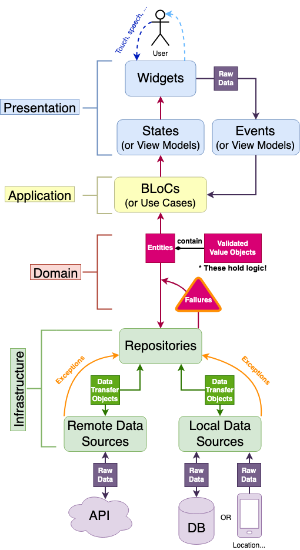

# DDD architecture in flutter

# Architectural Layers

### Presentation

With Domain-Driven Design, **UI is dumbest part of the app**. That's because it's at the boundary of our code and it's totally dependent on the Flutter framework. Its logic is limited to creating "eye candy" for the user. So while animation code does belong into this layer, even things like **form validation** are NOT done inside the presentation layer.

- **States** - Their sole purpose is to deliver values (variables) to the widgets.
- **Events** - Equivalent to methods inside a **`ChangeNotifier`**. These trigger logic inside the BLoC and can optionally carry some raw data (e.g. **`String`** from a **`TextField`**) to the BLoC.
- **BLoC NOT A PART OF THE PRESENTATION LAYER!** But it executes logic based on the incoming events and then it outputs states.

### Application

This layer is away from all of the outside interfaces of an app. **You *aren't* going to find any UI code, network code, or database code here.** Application layer has only one job - orchestrating all of the other layers. No matter where the data originates (user input, real-time Firestore `Stream`, device location), its **first destination** is going to be the application layer.

The role of the application layer is to decide "what to do next" with the data. It doesn't perform any complex business logic, instead, it mostly just makes sure that the *user input is validated* (by calling things in the **domain layer)** or it manages subscriptions to **infrastructure** data **`Stream`**s (not directly, but by utilizing the **[dependency inversion](https://en.wikipedia.org/wiki/Dependency_inversion_principle)** principle).

### Domain

The domain layer is the **pristine center** of an app. It is fully self contained and it *doesn't* depend on any other layers. Domain is not concerned with anything but doing its own job well.

This is the part of an app which doesn't care if you switch from Firebase to a REST API or if you change your mind and you migrate from the one database to another. **Because domain doesn't depend on anything external**, changes to such implementation details don't affect it. On the other hand, **all the other layers *do* depend on domain**.

So, what exactly goes on inside the domain layer? This is where your business logic lives. We are going to get to everything in detail in the next parts of this series, but everything which is not Flutter/server/device dependent goes into domain. This includes:

- **Validating data** and **keeping it valid** with **`ValueObject`**s. For example, instead of using a plain **`String`** for the body of a **`Note`**, we're going to have a separate class called **`NoteBody`**. It will encapsulate a **`String`** value and make sure that it's no more than 1000 characters long and that it's not empty.
- **Transforming data** *(e.g. make any color fully opaque)*.
- **Grouping** and **uniquely identifying data** that belongs together through **`Entity`** classes *(e.g. **`User`** or **`Note`** entities)*
- **Performing complex business logic** - this is not necessarily always the case in client Flutter apps, since you should *leave complex logic to the server*. Although, if you're building a ***truly serverless*** ? app, this is where you'd put that logic.

In addition to all this, the domain layer is also the home of **`Failure`**s. Handling exceptions is a ? experience. They're flying left and right across multiple layers of code. You have to check documentation (even your own one) a million times to know which method throws which exception. Even then, if you come back to your code in a few months, you're going to be again unsure if you handled all exceptional cases.

### Infrastructure

Much like **presentation**, this layer is also at the boundary of our app. Although, of course, it's at the "opposite end" and instead of dealing with the user input and visual output, it deals with APIs, Firebase libraries, databases and device sensors.

The infrastructure layer is composed of two parts - low-level **data sources** and high level **repositories**. Additionally, this layer holds **data transfer objects** (DTOs). Let's break it down!

**DTOs** are classes whose sole purpose is to convert data between **entities** and **value objects** from the domain layer and the plain data of the outside world. As you know, only dumb data like **`String`** or **`int`** can be stored inside Firestore but we don't want this kind of unvalidated data throughout our app. That's precisely why we'll use **`ValueObject`**s described above everywhere, except for the infractructure layer. DTOs can also be serialized and deserialized.

**Data sources** operate at the lowest level. *Remote* data sources fit JSON response strings gotten from a server into DTOs, and also perform server requests with DTOs converted to JSON. Similarly, *local* data sources fetch data from a local database or from the device sensors.

**Repositories** perform an important task of being the boundary between the **domain** and **application** layers and the ugly outside world. It's their job to take **DTOs** and unruly **`Exception`**s from data sources as their input, and return nice **`Either<Failure, Entity>`** as their output. 
